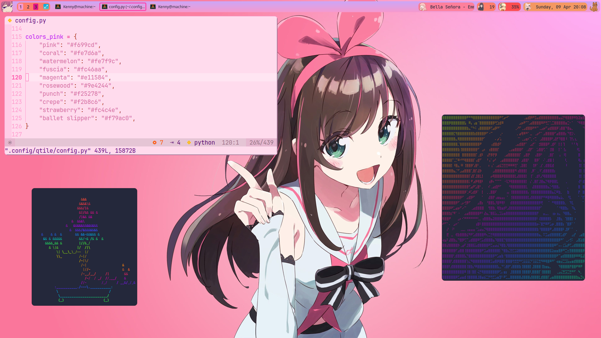

# cutile

My [cutile](http://www.qtile.org/) and [qtile-extras](https://qtile-extras.readthedocs.io/en/latest/index.html) config.
Using [pink-panic](https://github.com/scysta/pink-panic.nvim) neovim config,
[lolcat](https://github.com/busyloop/lolcat) for colorful text. Not a complete config, but a fun project nonetheless.
